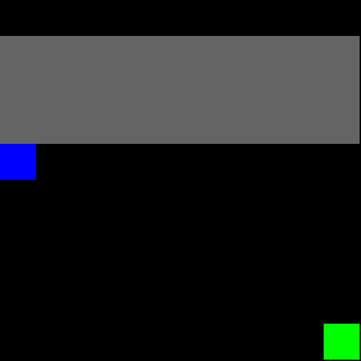
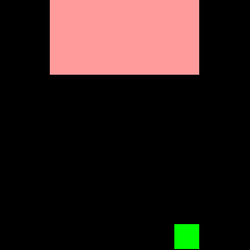
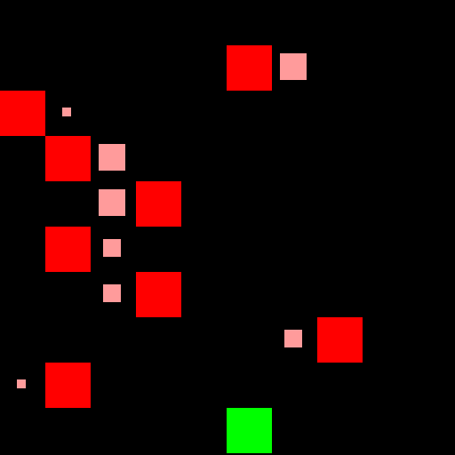
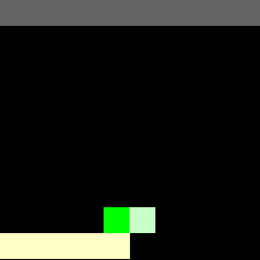
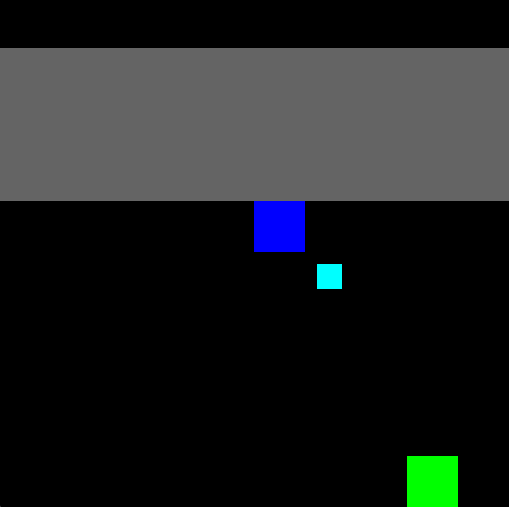
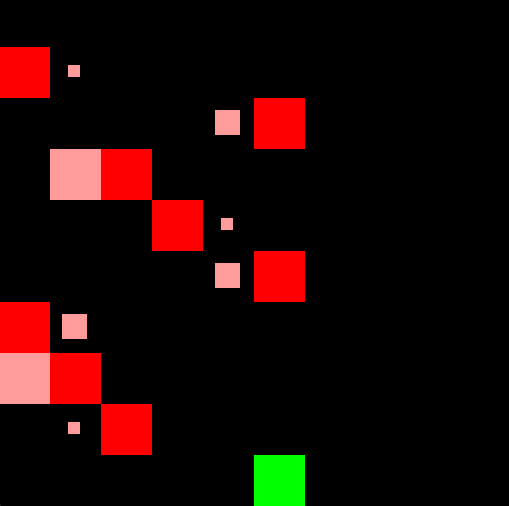
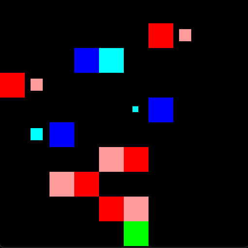
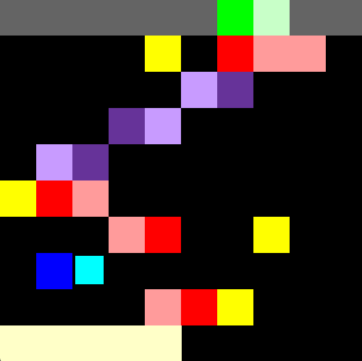

<div align="center">
    <a href=gym_minatar/breakout.py>
        <figure>
            
            <figcaption>Breakout</figcaption>
        </figure>
    </a>
    <a href=gym_minatar/space_invaders.py>
        <figure>
            
            <figcaption>Space Invaders</figcaption>
        </figure>
    </a>
    <a href=gym_minatar/freeway.py>
        <figure>
            
            <figcaption>Freeway</figcaption>
        </figure>
    </a>
    <a href=gym_minatar/asterix.py>
        <figure>
            
            <figcaption>Asterix</figcaption>
        </figure>
    </a>
    <a href=gym_minatar/seaquest.py>
        <figure>
            
            <figcaption>Seaquest</figcaption>
        </figure>
    </a>
</div>

## Overview
Collection of simplified [Atari](https://gymnasium.farama.org/environments/atari/)
games fully compatible with [Gymnasium](https://github.com/Farama-Foundation/Gymnasium).
Inspired by [MinAtar](https://github.com/kenjyoung/MinAtar).

#### Gym-MinAtar vs MinAtar
- All games are rendered with [PyGame](https://www.pygame.org/news) rather than
  [Matplotlib](https://matplotlib.org/), as in classic
  [Gymnasium](https://github.com/Farama-Foundation/Gymnasium) environments.
- Different observation spaces. In MinAtar, the observation space has separate
  channels for every entity in the game. Gym-MinAtar uses lower dimensional
  observation spaces with continuous values in [-1, 1].
  - For example, in MinAtar's Space Invaders, aliens moving left and aliens moving
  right are encoded in two separate channels (with binary values). Instead,
  Gym-MinAtar uses one channel with -1 for aliens moving left, and 1 for aliens
  moving right.
  - Another example is Freeway. MinAtar uses one channel for each car, while
  Gym-MinAtar uses one channel for all cars (the absolute value denotes the
  speed, the sign denotes the direction).
  - Different rendering scheme. MinAtar uses one pixel for trails (like
  car trails), with different colors for different speeds. Gym-MinAtar uses the
  same color for all trails, but trails are longer for faster cars.
  - Please refer to the examples below for more details about the observation spaces.
  - Optional flag to disable trails and make the games partially observable (agents
    would need frame stacking or architectures with memory to learn).
- Game-specific dynamics are different (like cooldown times and speeds).

### Install and Make an Environment
```
pip install -e .
```

```python
import gymnasium
import gym_minatar
env = gymnasium.make("Gym-MinAtar/SpaceInvaders-v1", render_mode="human")
env.reset()
env.step(1) # LEFT
env.step(3) # SHOOT
```

### Playground
```
pip install -e .[playground]
python playground.py breakout
```
This will start a Breakout game (commands are displayed on the terminal).
The flag `--record` allows you to record the game and save it to a GIF.
The flag `--practice` makes the game wait until the user sends an action (otherwise,
every 0.5 seconds the game receives NO-OP).

## Games
Actions are discrete, while observations have shape `(rows, cols, channels)`
with values in [-1, 1].
The number of actions and channels depends on the game.
All boards have size (10, 10) by default. To change it:
```python
gymnasium.make(..., size=(rows, cols))
```
To train from pixels:
```python
import gymnasium
import gym_minatar
env = gymnasium.make("Gym-MinAtar/SpaceInvaders-v1", render_mode="rgb_array", window_size=(84, 84))
env = gymnasium.wrappers.AddRenderObservation(env, render_only=True)
```

Below are some details about the games.
For full details, please refer to the docs in the source code (click on the game name).

### [`Gym-MinAtar/Breakout-v1`](gym_minatar/breakout.py)
<table>
  <tr>
    <td style="width: 250px;">
      
    </td>
    <td>
      <ul style="list-style-type:circle">
        <li>The player (green) has to bounce a ball (blue) to break bricks (gray).</li>
        <li>For every broken brick, the player receives 1 point.</li>
        <li>Once all bricks are broken, a new round starts with the ball moving faster.</li>
        <li>The ball speed is denoted by its trail (longer trails means faster ball).
        If the ball moves slower than 1 tile per timestep, its trail is smaller.</li>
        <li>The game ends if the player misses the ball.</li>
        <li>The player has 3 actions (LEFT, RIGHT, NO-OP) and the observation space
        has 3 channels for (in order): player, bricks, ball.</li>
      <ul>
    </td>
  </tr>
</table>

### [`Gym-MinAtar/SpaceInvaders-v1`](gym_minatar/space_invaders.py)
<table>
  <tr>
    <td style="width: 250px;">
      
    </td>
    <td>
      <ul style="list-style-type:circle">
        <li>The player (green) has to shoot down waves of aliens (red) with bullets
        (white), and receives 1 point every time it hits one alien.</li>
        <li>Aliens shoot the player as well (yellow), move left (pale red) or
        right (bright red), and change direction when they hit the sides of the board.</li>
        <li>Before changing direction, they move one tile down.
        As they move down, their speed increases.</li>
        <li>If the player destroys all aliens, a new round starts, with the aliens
        starting closer to the player.</li>
        <li>The game ends when the player is hit by a bullet or an alien.</li>
        <li>The player has 6 actions (LEFT, DOWN, RIGHT, UP, SHOOT, NO-OP) and
        the observation space has 4 channels for (in order): player, aliens,
        player bullets, aliens bullets</li>
      </ul>
    </td>
  </tr>
</table>

### [`Gym-MinAtar/Freeway-v1`](gym_minatar/freeway.py)
<table>
  <tr>
    <td style="width: 250px;">
      
    </td>
    <td>
      <ul style="list-style-type:circle">
        <li>The player (green) has to cross a road while avoiding cars (red).</li>
        <li>Cars move at different speed, denoted by the trail behind them
        (longer trails means faster car).
        If a car moves slower than 1 tile per timestep, its trail is smaller.</li>
        <li>When a car leaves the board, it spawns in the same row from the opposite side.</li>
        <li>When the player crosses the road (reaches the top), it receives 1 point
        and a new round starts with faster cars.</li>
        <li>The game ends when the player is hit by a car.</li>
        <li>The player has 3 actions (UP, DOWN, NO-OP) and the observation space
        has 2 channels for (in order): player and cars.</li>
      </ul>
    </td>
  </tr>
</table>


### [`Gym-MinAtar/Asterix-v1`](gym_minatar/asterix.py)
<table>
  <tr>
    <td style="width: 250px;">
      
    </td>
    <td>
      <ul style="list-style-type:circle">
        <li>The player (green) has to collect treasures (blue) to get points (1 per treasure)
        while avoiding enemies (red).</li>
        <li>Treasures and enemies move at different speeds, denoted by the trail behind them
        (the longer, the faster).
        If they move slower than 1 tile per timestep, their trail is smaller.</li>
        <li>When treasures and enemies leave the screen (or are collected, if treasure)
        some time must pass before a new one randomly appears in the same row.</li>
        <li>Over time, enemies and treasures speed increases and respawn wait time decreases.</li>
        <li>The game ends when the player is hit by an enemy.</li>
        <li>The player has 5 actions (LEFT, DOWN, RIGHT, UP, NO-OP) and the observation space
        has 3 channels for (in order): player, enemies, and treasures.</li>
    </td>
  </tr>
</table>


### [`Gym-MinAtar/Seaquest-v1`](gym_minatar/seaquest.py)
<table>
  <tr>
    <td style="width: 250px;">
      
    </td>
    <td>
      <ul style="list-style-type:circle">
        <li>The player (green) must collect divers (blue) and bring them to the
        surface (gray) while shooting enemies with bullets (white).</li>
        <li>The player has a front (bright green) and a back (pale green), and shoots
        from its front.</li>
        <li>Enemies are fishes (purple) and submarines (red). Submarines can shoot bullets (yellow).</li>
        <li>Hitting an enemy gives the player 1 point.</li>
        <li>The player has limited oxygen (gauge at the bottom left)
        that depletes over time.</li>
        <li>Carrying 6 divers to the surface gives as many points as the amount of
        oxygen left, and the oxygen is replenished. The number of divers carried by
        the player is denoted by gauge at the bottom right.
        If the player is carrying less than 6 divers but at least 1, it doesn't
        receive any point but its oxygen is still replenished.</li>
        <li>The game ends if the player is hit by an enemy or a bullet, its oxygen
        depletes, or if it emerges without carrying any diver.</li>
        <li>Enemies and divers move at different speeds and leave a trail. When one
        leaves the board, some time must pass before a new one respawns (like Asterix).</li>
        <li>Every time the player emerges and submerges again, difficulty increases
        (enemies and divers move faster, respawn time decreases).</li>
        <li>The player has 6 actions (LEFT, DOWN, RIGHT, UP, SHOOT, NO-OP) and
        the observation space has 8 channels for (in order): player, player bullets,
        fishes, submarines, submarines bullets, divers, oxygen gauge, and divers
        carried gauge.</li>
      <ul>
    </td>
  </tr>
</table>

## Observations
Below are some example of both default and pixels observations to better
understand how speed and trail are encoded (Space Invaders is not shown because
aliens leave no trail -- their speed is determined by how far they have descended).  
To see all observation channels, run code below with the game you want.

Note that all games are **partially observable**.
- In Breakout, Freeway, Asterix, and Seaquest, trails tell "how soon" slow-moving
  entities (ball, cars, enemies, ...) will move, but not their exact speed.
- In Asterix and Seaquest, observations do not encode respawn times.
- In Seaquest and Space Invaders, observations do not encode shooting cooldowns.
- In Seaquest and Space Invaders, observations do not encode when just-spawned
  entities will move (they have no trail yet).
- In Seaquest, gauges do not represent exactly how much oxygen the agent has
  left, and how many divers it is carrying.
Nonetheless, single observations (without stacking) should be sufficient for acting
near-optimally in all games.

It is also possible to disable trails and direction information completely
(both in matrix and pixel observations):
```python
import gymnasium
import gym_minatar
env = gymnasium.make("Gym-MinAtar/SpaceInvaders-v1", no_trail=True)
```
To learn in this setting, one must either stack frames or use training
architectures with memory.


```python
import gymnasium
import gym_minatar
import numpy as np

@np.printoptions(precision=2)
def print_obs(obs):
    print()
    for i in range(obs.shape[-1]):
        print(f"--- channel {i}")
        print(obs[..., i])

env = gymnasium.make("Gym-MinAtar/Asterix-v1", render_mode="human")
obs, _ = env.reset()
print_obs(obs)
obs, *_ = env.step(1)
print_obs(obs)
```

<table>
  <tr>
    <td>
      
    </td>
    <td>
      <pre>
[[ 0.  0.  0.  0.  0.  0.  0.  0.  0.  0. ]
 [ 0.  0.  0.  0.  0.  0.  0.  0.  0.  0. ]
 [ 0.  0.  0.  0.  0.  0.  0.  0.  0.  0. ]
 [ 0.  0.  0.  0.  0.  0.  0.  0.  0.  0. ]
 [ 0.  0.  0.  0.  0. -1.  0.  0.  0.  0. ]
 [ 0.  0.  0.  0.  0.  0. -0.5 0.  0.  0. ]
 [ 0.  0.  0.  0.  0.  0.  0.  0.  0.  0. ]
 [ 0.  0.  0.  0.  0.  0.  0.  0.  0.  0. ]
 [ 0.  0.  0.  0.  0.  0.  0.  0.  0.  0. ]
 [ 0.  0.  0.  0.  0.  0.  0.  0.  0.  0. ]]
      </pre>
    </td>
  </tr>
</table>

<p>
Third channel of <b>Breakout</b> observation. The sign of non-zero elements denotes the ball direction
(negative going up, positive going down); the absolute value is proportional to the speed <i>if the ball moves
slower than 1 tile per timestep</i>. In the example, the ball takes 2 timesteps to move.
</p>

<table>
  <tr>
    <td>
      
    </td>
    <td>
      <pre>
[[ 0.  0.  0.   0.  0.   0.  0.  0.   0.  0.  ]
 [ 0.  0.  0.   0.  0.   0.  0.  0.75 1.  0.  ]
 [ 1.  0.  0.   0.  0.   0.  0.  0.   0.  0.75]
 [ 0.  0.  0.   0.  0.   0.  0.5 1.   0.  0.  ]
 [ 0.  0.  0.   0.  0.75 1.  0.  0.   0.  0.  ]
 [ 0.  0.  0.5  1.  0.   0.  0.  0.   0.  0.  ]
 [ 0.  0. -1.  -1.  0.   0.  0.  0.   0.  0.  ]
 [-0.5 0.  0.   0.  0.   0.  0.  0.   0. -1.  ]
 [ 0.  0.  0.   0.5 1.   0.  0.  0.   0.  0.  ]
 [ 0.  0.  0.   0.  0.   0.  0.  0.   0.  0.  ]]
      </pre>
    </td>
  </tr>
</table>

<p>
Second channel of <b>Freeway</b> observation. The encoding of speed and trail follows the same rules of Breakout.
The example shows that cars moving at 1 tile per timestep (sixth car) encode trails with absolute value 1.
Cars moving slower (all other cars) encode speed with absolute value smaller than 1 (the smaller,
the more timesteps will pass before it moves).
In example, the slowest speed a car can have is -3 (delay of 3 timesteps), and their trail
value can be either 0.25 (moving in 4 timesteps), 0.5 (moving in 3 timesteps), 0.75
(moving in 3 timesteps), or 1.0 (moving next timestep). Note that these values
encode <i>when</i> the car will move but not their actual <i>speed</i>.
<br>
Also, note that car wrap around the screen (e.g., second car moving to the left).
</p>

<table>
  <tr>
    <td>
      
    </td>
    <td>
      <pre>
[[ 0. 0. 0.   0. 0.  0.  0.   0. 0.  0.]
 [ 0. 0. 0.   0. 0. -1. -0.33 0. 0.  0.]
 [ 0. 0. 0.   0. 0. -1. -0.67 0. 0.  0.]
 [ 0. 0. 0.   0. 1.  1.  0.   0. 0.  0.]
 [ 0. 0. 0.   0. 0.  0.  0.   0. 0.  0.]
 [ 0. 0. 0.   0. 0.  0.  0.   0. 0. -1.]
 [ 0. 0. 0.   0. 0.  0.  0.   0. 0. -1.]
 [ 0. 0. 0.67 1. 0.  0.  0.   0. 0.  0.]
 [ 0. 0. 0.   0. 0. -1. -1.   0. 0.  0.]
 [ 0. 0. 0.   0. 0.  0.  0.   0. 0.  0.]]
      </pre>
    </td>
  </tr>
</table>

<p>
Second channel of <b>Asterix</b> observation. It's like Freeway's, but it only
encodes enemies (treasures are encoded in the third channel).
In this case, the slowest speed is -2.
<br>
Also, note that entities that just spawned don't have a trail yet (fourth and fifth enemy).
</p>

<table>
  <tr>
    <td>
      
    </td>
    <td>
      <pre>
  [[ 0.  0.  0.  0.  0.  0.  0.  0.  0.  0.]
   [ 0.  0.  0.  0. -1.  0. -1. -1. -1.  0.]
   [ 0.  0.  0.  0.  0.  0.  0.  0.  0.  0.]
   [ 0.  0.  0.  0.  0.  0.  0.  0.  0.  0.]
   [ 0.  0.  0.  0.  0.  0.  0.  0.  0.  0.]
   [-1. -1. -1.  0.  0.  0.  0.  0.  0.  0.]
   [ 0.  0.  0.  1.  1.  0.  0.  1.  0.  0.]
   [ 0.  0.  0.  0.  0.  0.  0.  0.  0.  0.]
   [ 0.  0.  0.  0.  1.  1.  1.  0.  0.  0.]
   [ 0.  0.  0.  0.  0.  0.  0.  0.  0.  0.]]
      </pre>
    </td>
  </tr>
</table>

<p>
Third channel of <b>Seaquest</b> observation. It's like Asterix's but for submarines, and with the addition of bullets.
In this example, the first submarine is moving at speed 2 (2 tiles per timestep),
while the other at speed 1 (1 tiles per timestep). This is denoted by the length
of their trail in both the matrix and pixel encoding.
<br>
All submarines have shot bullets, denoted by an additional 1 (or -1) in the matrix
encoding, and by the yellow tile in the pixel encoding. Note that the matrix encoding
is ambiguous, and the bullet can be interpreted as a longer trail.
</p>
