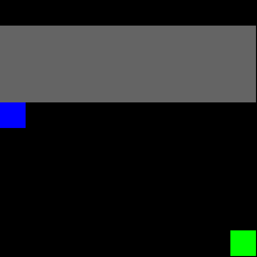
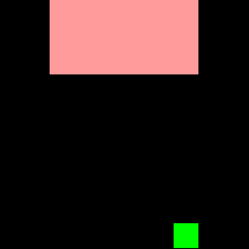
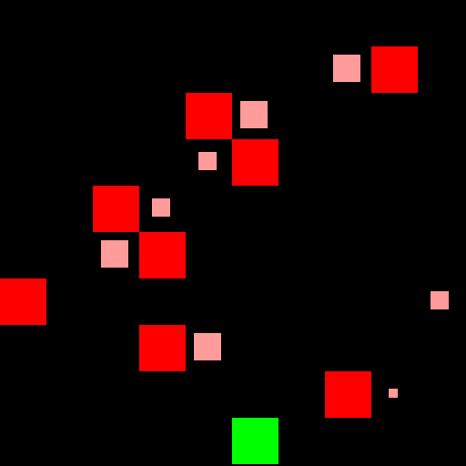
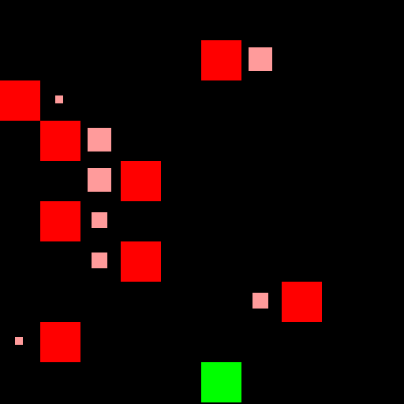
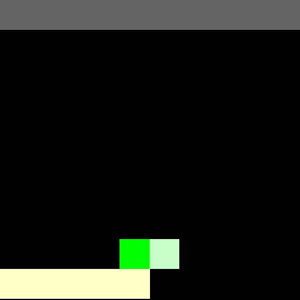
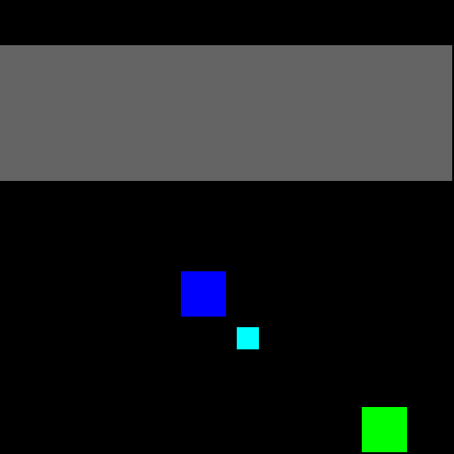
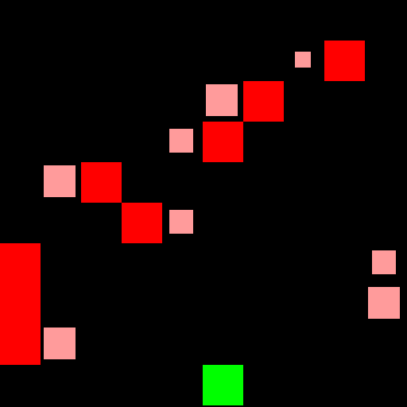
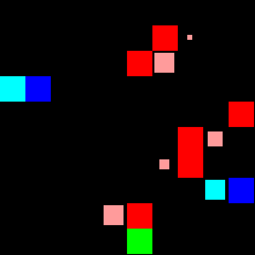

# Gym-MinAtar

<div align="center">
    <a href=gym_minatar/breakout.py>
        <figure>
            
            <figcaption>Breakout</figcaption>
        </figure>
    </a>
    <a href=gym_minatar/space_invaders.py>
        <figure>
            
            <figcaption>Space Invaders</figcaption>
        </figure>
    </a>
    <a href=gym_minatar/freeway.py>
        <figure>
            
            <figcaption>Freeway</figcaption>
        </figure>
    </a>
    <a href=gym_minatar/asterix.py>
        <figure>
            
            <figcaption>Asterix</figcaption>
        </figure>
    </a>
    <a href=gym_minatar/seaquest.py>
        <figure>
            
            <figcaption>Seaquest</figcaption>
        </figure>
    </a>
</div>

## Overview
Collection of simplified [Atari](https://gymnasium.farama.org/environments/atari/)
games fully compatible with [Gymnasium](https://github.com/Farama-Foundation/Gymnasium).
Inspired by [MinAtar](https://github.com/kenjyoung/MinAtar).

### Gym-MinAtar vs MinAtar
- All games are rendered with [PyGame](https://www.pygame.org/news) rather than
  [Matplotlib](https://matplotlib.org/), as in classic
  [Gymnasium](https://github.com/Farama-Foundation/Gymnasium) environments.
- <ins>Different observation spaces</ins>. In MinAtar, the observation space has separate
  channels for every entity in the game. Gym-MinAtar uses lower dimensional
  observation spaces with continuous values in [-1, 1].
  - For example, in MinAtar's Space Invaders, aliens moving left and aliens moving
  right are encoded in two separate channels. Instead, Gym-MinAtar uses one
  channel with -1 for aliens moving left, and 1 for aliens moving right.
  - Similarly, in Freeway MinAtar uses one channel for the cars and five more for their
    trails (the channel tells how often the car moves), while Gym-MinAtar uses one channel
    for all cars, whose value encodes both direction and when the car will move.
- <ins>Different rendering scheme</ins>. MinAtar uses one pixel for trails (e.g.,
  car trails), with different colors for different speeds. Gym-MinAtar uses the
  same color for all trails, but trails are longer for faster cars.
- <ins>Optional flag to disable trails</ins> and make the games partially observable (agents
  would need frame stacking or architectures with memory to learn).
- Game-specific <ins>dynamics are different</ins> (like cooldown times and speeds).

### Install and Make an Environment
Requires Python >= 3.9 and Gymnasium >= 1.0.
```
pip install -e .
```

```python
import gymnasium
import gym_minatar
env = gymnasium.make("Gym-MinAtar/SpaceInvaders-v1", render_mode="human")
env.reset()
env.step(1)  # LEFT
env.step(3)  # SHOOT
```
Episodes are truncated after 10,000 steps.

### Playground
```
pip install -e ".[playground]"
python playground.py breakout
```
This will start a Breakout game (commands are displayed on the terminal).
Any game works: `breakout`, `space_invaders`, `freeway`, `asterix`, `seaquest`.
The name is matched ignoring case and punctuation, so `space_invaders`,
`spaceinvaders`, and `SpaceInvaders` are all the same game.
Optional flags:
- `--record` records the game and saves it to a GIF.
- `--practice` makes the game wait until you send an action (otherwise,
  every 0.5 seconds the game receives NO-OP).
- `--no_trail` disables trails (see [Disable Trails](#disable-trails)).

## Games
Actions are discrete, while observations have shape `(rows, cols, channels)`
with values in [-1, 1].
The number of actions and channels depends on the game.
All screens have size (10, 10) by default. To change it:
```python
gymnasium.make(..., size=(rows, cols))
```
Breakout and Space Invaders accept one extra argument each, `brick_rows` and
`aliens_rows` (both default to 3).

To train from pixels:
```python
import gymnasium
import gym_minatar
env = gymnasium.make("Gym-MinAtar/SpaceInvaders-v1", render_mode="rgb_array", window_size=(84, 84))
env = gymnasium.wrappers.AddRenderObservation(env, render_only=True)
```
The optional argument `window_size` resizes the rendering. It is in pixels and
ordered `(width, height)`, that is, `(cols, rows)`.
By default, the window is 64 pixels per tile and capped at (512, 512), so with
the default (10, 10) screen the rendering size is (512, 512).


Below are some info about the games.
For full details, please refer to the docs in the source code (click on the game name).

### [`Gym-MinAtar/Breakout-v1`](gym_minatar/breakout.py)
<table>
  <tr>
    <td style="width: 250px;">
      
    </td>
    <td>
      <ul style="list-style-type:circle">
        <li>The player (green) has to bounce a ball (blue) to break bricks (gray).</li>
        <li>For every broken brick, the player receives 1 point.</li>
        <li>Once all bricks are broken, a new round starts with the ball moving faster.</li>
        <li>The ball speed is denoted by its trail (longer trails means faster ball).
        If the ball moves slower than 1 tile per timestep, its trail is smaller.</li>
        <li>The game ends if the player misses the ball.</li>
        <li>The player has 3 actions for (in order): NO-OP, LEFT, RIGHT.
        The observation space has 3 channels for (in order): player, bricks, ball.</li>
      </ul>
    </td>
  </tr>
</table>

### [`Gym-MinAtar/SpaceInvaders-v1`](gym_minatar/space_invaders.py)
<table>
  <tr>
    <td style="width: 250px;">
      
    </td>
    <td>
      <ul style="list-style-type:circle">
        <li>The player (green) has to shoot down waves of aliens (red) with bullets
        (white).</li>
        <li>For every alien hit, the player receives 1 point.</li>
        <li>Aliens shoot the player as well (yellow), move left (pale red) or
        right (bright red), and change direction when they hit the sides of the screen.</li>
        <li>Before changing direction, they move one tile down.
        As they move down, their speed increases.</li>
        <li>If the player destroys all aliens, a new round starts with the aliens
        starting closer to the player.</li>
        <li>The game ends when the player is hit by an alien bullet, or when the
        aliens descend to the player's row (they do not need to hit the player).</li>
        <li>The player has 4 actions for (in order): NO-OP, LEFT, RIGHT, SHOOT.
        The observation space has 4 channels for (in order): player, aliens,
        player bullets, aliens bullets.</li>
      </ul>
    </td>
  </tr>
</table>

### [`Gym-MinAtar/Freeway-v1`](gym_minatar/freeway.py)
<table>
  <tr>
    <td style="width: 250px;">
      
    </td>
    <td>
      <ul style="list-style-type:circle">
        <li>The player (green) has to cross a road while avoiding cars (red).</li>
        <li>Cars move at different speed, denoted by the trail behind them
        (longer trails means faster car).
        If a car moves slower than 1 tile per timestep, its trail is smaller.</li>
        <li>When a car leaves the screen, it spawns in the same row from the opposite side.</li>
        <li>When the player crosses the road (reaches the top), it receives 1 point
        and a new round starts with faster cars.</li>
        <li>The game ends when the player is hit by a car.</li>
        <li>The player has 3 actions for (in order): NO-OP, UP, DOWN.
        The observation space has 2 channels for (in order): player and cars.</li>
      </ul>
    </td>
  </tr>
</table>


### [`Gym-MinAtar/Asterix-v1`](gym_minatar/asterix.py)
<table>
  <tr>
    <td style="width: 250px;">
      
    </td>
    <td>
      <ul style="list-style-type:circle">
        <li>The player (green) has to collect treasures (blue) to get points (1 per treasure)
        while avoiding enemies (red).</li>
        <li>Treasures and enemies move at different speeds, denoted by the trail behind them
        (the longer the trail, the faster the treasure or the enemy).
        If they move slower than 1 tile per timestep, their trail is smaller.</li>
        <li>When treasures and enemies leave the screen (or are collected, if treasure)
        some time must pass before a new one randomly appears in the same row.</li>
        <li>Over time, enemies and treasures speed increases and respawn wait time decreases.</li>
        <li>The game ends when the player is hit by an enemy.</li>
        <li>The player has 5 actions for (in order): NO-OP, LEFT, RIGHT, UP, DOWN.
        The observation space has 3 channels for (in order): player, enemies, and
        treasures.</li>
      </ul>
    </td>
  </tr>
</table>


### [`Gym-MinAtar/Seaquest-v1`](gym_minatar/seaquest.py)
<table>
  <tr>
    <td style="width: 250px;">
      
    </td>
    <td>
      <ul style="list-style-type:circle">
        <li>The player (green) must collect divers (blue) and bring them to the
        surface (gray) while shooting enemies with bullets (white).</li>
        <li>The player has a front (bright green) and a back (pale green), and shoots
        from the front.</li>
        <li>Enemies are fishes (purple) and submarines (red). Submarines can shoot bullets (yellow). Hitting an enemy gives the player 1 point.</li>
        <li>The player has limited oxygen (gauge at the bottom left)
        that depletes over time.</li>
        <li>Carrying 6 divers to the surface gives as many points as the amount of
        oxygen left, and the oxygen is replenished. The number of divers carried by
        the player is denoted by gauge at the bottom right.
        If the player is carrying less than 6 divers but at least 1, it doesn't
        receive any point, but its oxygen is still replenished and one diver is
        removed.</li>
        <li>The game ends if the player is hit by an enemy or a bullet, its oxygen
        depletes, or if it emerges without carrying any diver.</li>
        <li>Enemies and divers move at different speeds and leave a trail. When one
        leaves the screen, some time must pass before a new one respawns (like Asterix).</li>
        <li>Every time the player emerges carrying at least one diver, difficulty
        increases (enemies and divers move faster, respawn time decreases).</li>
        <li>The player has 6 actions for (in order): NO-OP, LEFT, RIGHT, UP, DOWN,
        SHOOT.
        The observation space has 8 channels for (in order): player, player bullets,
        fishes, submarines, submarines bullets, divers, oxygen gauge, and divers
        gauge.</li>
      </ul>
    </td>
  </tr>
</table>

## Observations
All games are **partially observable**.
- In Breakout, Freeway, Asterix, and Seaquest, trails tell "how soon" slow-moving
  entities (ball, cars, enemies, ...) will move, but not their exact speed.
- In Asterix and Seaquest, observations do not encode respawn times.
- In Asterix and Seaquest, entities that just spawned have no trail yet, so
  observations do not encode when they will move for the first time.
- In Seaquest and Space Invaders, observations do not encode shooting cooldowns.
- In Space Invaders, aliens have no trail at all: their speed can be inferred
  from how far they have descended, but observations do not encode when they
  will move next.
- In Seaquest, gauges do not represent the exact amount of oxygen left or the
  exact number of divers carried.

Nonetheless, single observations (without stacking) should be sufficient for acting
near-optimally in all games.

### Examples
Below are some example of both default and pixels observations to better
understand how speed and trail are encoded (Space Invaders is not shown because
aliens leave no trail -- their speed is determined by how far they have descended).  
To see all observation channels, run code below with the game you want.

```python
import gymnasium
import gym_minatar
import numpy as np

@np.printoptions(precision=2)
def print_obs(obs):
    print()
    for i in range(obs.shape[-1]):
        print(f"--- channel {i}")
        print(obs[..., i])

env = gymnasium.make("Gym-MinAtar/Asterix-v1", render_mode="human")
obs, _ = env.reset(seed=0)
print_obs(obs)
obs, *_ = env.step(0)  # NO-OP
print_obs(obs)
```

<table>
  <tr>
    <td>
      
    </td>
    <td>
      <pre>
[[ 0.   0.   0.   0.   0.   0.   0.   0.   0.   0. ]
 [ 0.   0.   0.   0.   0.   0.   0.   0.   0.   0. ]
 [ 0.   0.   0.   0.   0.   0.   0.   0.   0.   0. ]
 [ 0.   0.   0.   0.   0.   0.   0.   0.   0.   0. ]
 [ 0.   0.   0.   0.   0.   0.   0.   0.   0.   0. ]
 [ 0.   0.   0.   0.   0.   0.   0.   0.   0.   0. ]
 [ 0.   0.   0.   0.  -1.   0.   0.   0.   0.   0. ]
 [ 0.   0.   0.   0.   0.  -0.5  0.   0.   0.   0. ]
 [ 0.   0.   0.   0.   0.   0.   0.   0.   0.   0. ]
 [ 0.   0.   0.   0.   0.   0.   0.   0.   0.   0. ]]
      </pre>
    </td>
  </tr>
</table>

<p>
Third channel of <b>Breakout</b> observation.
Non-zero tiles are the ball and its trail, and their sign denotes the ball direction
(negative going up, positive going down).
The absolute value of the trail encodes <i>when</i> the ball will move:
0.5 means it moves in 2 timesteps, 1 means it moves next timestep.
In the example, the ball is in the seventh row (-1) and its trail in the eighth (-0.5),
so the ball takes 2 timesteps to move.
Note that when the ball hits a brick or the paddle it stays in place for one step: its own
tile is then also its trail, and shows the trail value instead of 1.
</p>

<table>
  <tr>
    <td>
      
    </td>
    <td>
      <pre>
[[ 0.   0.   0.   0.   0.   0.   0.   0.   0.   0. ]
 [ 0.   0.   0.   0.   0.   0.   0.   0.4  1.   0. ]
 [ 0.   0.   0.   0.   0.   0.8  1.   0.   0.   0. ]
 [ 0.   0.   0.   0.   0.6  1.   0.   0.   0.   0. ]
 [ 0.   0.8  1.   0.   0.   0.   0.   0.   0.   0. ]
 [ 0.   0.   0.  -1.  -0.6  0.   0.   0.   0.   0. ]
 [ 1.   0.   0.   0.   0.   0.   0.   0.   0.   0.6]
 [ 1.   0.   0.   0.   0.   0.   0.   0.   0.   0.8]
 [-1.  -0.8  0.   0.   0.   0.   0.   0.   0.   0. ]
 [ 0.   0.   0.   0.   0.   0.   0.   0.   0.   0. ]]
      </pre>
    </td>
  </tr>
</table>

<p>
Second channel of <b>Freeway</b> observation.
The encoding of speed and trail follows the same rules of Breakout: the car itself always
has absolute value 1, and the tile behind it is its trail.
The absolute value of the trail encodes <i>when</i> the car will move, not its actual <i>speed</i>:
the smaller, the more timesteps will pass before the car moves.
At the first level, cars have speed between -2 and -4 (a delay of 2 to 4 timesteps), so trail
values are multiples of 0.2: 0.2 (moving in 5 timesteps), 0.4 (in 4), 0.6 (in 3), 0.8 (in 2),
and 1.0 (next timestep).
Faster cars (later levels) move by more than 1 tile per timestep, and leave a longer trail of 1s.
<br>
Also, note that cars wrap around the screen. For example, the cars in the seventh and eighth
rows are moving to the right, but their trail is still in the rightmost tile
(their previous position).
</p>

<table>
  <tr>
    <td>
      
    </td>
    <td>
      <pre>
[[ 0.   0.   0.   0.   0.   0.   0.   0.   0.   0. ]
 [ 0.   0.   0.   0.   0.   0.  -1.  -0.2  0.   0. ]
 [ 0.   0.   0.   0.   0.  -1.  -0.8  0.   0.   0. ]
 [ 0.   0.   0.   0.   0.   0.   0.   0.   0.   0. ]
 [ 0.   0.   0.   0.   0.   0.   0.   0.   0.  -1. ]
 [ 0.   0.   0.   0.   0.   0.   0.  -1.  -0.6  0. ]
 [ 0.   0.   0.   0.   0.   0.   0.4  1.   0.   0. ]
 [ 0.   0.   0.   0.   0.   0.   0.   0.   0.   0. ]
 [ 0.   0.   0.   0.   0.8  1.   0.   0.   0.   0. ]
 [ 0.   0.   0.   0.   0.   0.   0.   0.   0.   0. ]]
      </pre>
    </td>
  </tr>
</table>

<p>
Second channel of <b>Asterix</b> observation.
It's like Freeway, but it only encodes enemies (treasures are encoded in the third channel).
Speeds and trail values follow the same rules (at the first level, speed between -2 and -4,
and trail values multiples of 0.2).
<br>
Also, note that entities that just spawned don't have a trail yet (the enemy in the fifth row),
as they don't wrap around the screen.
</p>

<p>
<b>Seaquest</b> is encoded like Asterix, with one channel for every entity type
(fish, submarine, submarine bullet, player bullet, diver). The main difference is
that bullets don't leave a trail in the rendering (but they do in the matrix), since
their speed can be inferred from the position and speed of the submarine
that shot them.
<br>
<br>
<b>Space Invaders</b> has no trail. Instead, aliens are colored differently
when they move left or right (in the matrix encoding, their sign changes).
</p>

### Disable Trails
You can disable trails and direction information completely with the `no_trail` flag:
```python
import gymnasium
import gym_minatar
env = gymnasium.make("Gym-MinAtar/Freeway-v1", no_trail=True)
```
Rendering will have no trail at all, and matrix encoding will have no trail and no sign.
Below is the same Freeway state shown above, with and without trails.

<table>
  <tr>
    <td>
      <pre>
[[ 0.   0.   0.   0.   0.   0.   0.   0.   0.   0. ]
 [ 0.   0.   0.   0.   0.   0.   0.   0.4  1.   0. ]
 [ 0.   0.   0.   0.   0.   0.8  1.   0.   0.   0. ]
 [ 0.   0.   0.   0.   0.6  1.   0.   0.   0.   0. ]
 [ 0.   0.8  1.   0.   0.   0.   0.   0.   0.   0. ]
 [ 0.   0.   0.  -1.  -0.6  0.   0.   0.   0.   0. ]
 [ 1.   0.   0.   0.   0.   0.   0.   0.   0.   0.6]
 [ 1.   0.   0.   0.   0.   0.   0.   0.   0.   0.8]
 [-1.  -0.8  0.   0.   0.   0.   0.   0.   0.   0. ]
 [ 0.   0.   0.   0.   0.   0.   0.   0.   0.   0. ]]
      </pre>
    </td>
    <td>
    <p align="center">
    <code>no_trail=True</code>
    <br>
    &rArr;
    </p>
    </td>
    <td>
      <pre>
[[0. 0. 0. 0. 0. 0. 0. 0. 0. 0.]
 [0. 0. 0. 0. 0. 0. 0. 0. 1. 0.]
 [0. 0. 0. 0. 0. 0. 1. 0. 0. 0.]
 [0. 0. 0. 0. 0. 1. 0. 0. 0. 0.]
 [0. 0. 1. 0. 0. 0. 0. 0. 0. 0.]
 [0. 0. 0. 1. 0. 0. 0. 0. 0. 0.]
 [1. 0. 0. 0. 0. 0. 0. 0. 0. 0.]
 [1. 0. 0. 0. 0. 0. 0. 0. 0. 0.]
 [1. 0. 0. 0. 0. 0. 0. 0. 0. 0.]
 [0. 0. 0. 0. 0. 0. 0. 0. 0. 0.]]
      </pre>
    </td>
  </tr>
</table>

To learn in this setting, you must either stack frames or use training
architectures with memory.

## License
Gym-MinAtar is released under the [CC BY 4.0](LICENSE) license.

## Citation
If you use this software, please cite it as below (see [CITATION.cff](CITATION.cff)).

```bibtex
@software{parisi2026gymminatar,
  author  = {Parisi, Simone},
  title   = {Gym-MinAtar},
  year    = {2026},
  url     = {https://github.com/sparisi/gym_minatar},
  version = {1.0},
  license = {CC-BY-4.0},
}
```
