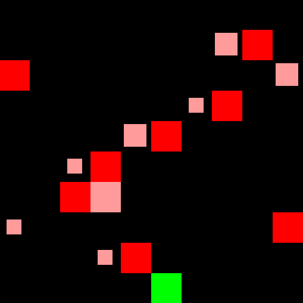

<div align="center">
    <a href=gym_minatar/breakout.py>
        <figure>
            
            <figcaption>Breakout</figcaption>
        </figure>
    </a>
    <a href=gym_minatar/space_invaders.py>
        <figure>
            
            <figcaption>Space Invaders</figcaption>
        </figure>
    </a>
    <a href=gym_minatar/freeway.py>
        <figure>
            
            <figcaption>Freeway</figcaption>
        </figure>
    </a>
    <a href=gym_minatar/asterix.py>
        <figure>
            
            <figcaption>Asterix</figcaption>
        </figure>
    </a>
    <a href=gym_minatar/seaquest.py>
        <figure>
            
            <figcaption>Seaquest</figcaption>
        </figure>
    </a>
</div>

## Overview
Collection of simplified [Atari](https://gymnasium.farama.org/environments/atari/)
games fully compatible with [Gymnasium](https://github.com/Farama-Foundation/Gymnasium).
Inspired by [MinAtar](https://github.com/kenjyoung/MinAtar).

#### Gym-MinAtar vs MinAtar
- All games are rendered with [PyGame](https://www.pygame.org/news) rather than
  [Matplotlib](https://matplotlib.org/), as in classic
  [Gymnasium](https://github.com/Farama-Foundation/Gymnasium) environments.
- Different observation spaces. In MinAtar, the observation space has separate
  channels for every entity in the game. Gym-MinAtar uses lower dimensional
  observation spaces with continuous values in [-1, 1].
  - For example, in MinAtar's Space Invaders, aliens moving left and aliens moving
  right are encoded in two separate channels (with binary values). Instead,
  Gym-MinAtar uses one channel with -1 for aliens moving left, and 1 for aliens
  moving right.
  - Another example is Freeway. MinAtar uses one channel for each car, while
  Gym-MinAtar uses one channel for all cars (the absolute value denotes the
  speed, the sign denotes the direction).
  - Different rendering scheme. MinAtar uses one pixel for trails (like
  car trails), with different colors for different speeds. Gym-MinAtar uses the
  same color for all trails, but trails are longer for faster cars.
  - Please refer to the examples below for a description of the observation spaces.
- Game-specific dynamics are different (like cooldown times and speeds).

### Install and Make an Environment
```
pip install -e .
```

```python
import gymnasium
import gym_minatar
env = gymnasium.make("Gym-MinAtar/SpaceInvaders-v1", render_mode="human")
env.reset()
env.step(1) # LEFT
env.step(3) # SHOOT
env.render()
```

### Playground
```
pip install -e .[playground]
python playground.py breakout
```
This will start a Breakout game (commands are displayed on the terminal).
The flag `--record` allows you to record the game and save it to a GIF.
The flag `--practice` makes the game wait until press a key to act.

## Games
Actions are discrete, while observations have shape `(rows, cols, channels)`
with ternary values (-1, 0, or 1).
The number of actions and channels depends on the game.
All boards have size (10, 10) by default. To change it:
```python
gymnasium.make(..., size=(rows, cols))
```
To train from RGB images:
```python
import gymnasium
import gym_minatar
env = gymnasium.make("Gym-MinAtar/SpaceInvaders-v1", render_mode="rgb_array", window_size=(84, 84))
env = gymnasium.wrappers.AddRenderObservation(env, render_only=True)
```

Below are some details about the games.
For full details, please refer to the docs in the source code (click on the game name).

### [`Gym-MinAtar/Breakout-v1`](gym_minatar/breakout.py)
<table>
  <tr>
    <td style="width: 250px;">
      
    </td>
    <td>
      The player (green) has to bounce a ball (blue) to break bricks (gray).
      Once all bricks are broken, a new round starts with the ball moving faster.
      The ball speed is denoted by its trail (longer trails means faster ball).
      <br>
      The game ends if the player misses the ball (letting it touch the bottom row).
      <br>
      The player has 3 actions (LEFT, RIGHT, NO-OP) and the observation space
      has 3 channels for (in order): bricks (1), player position (1), ball position and trail (-1 moving
      up, 1 moving down).  
      <br>
      This game is <b>fully observable</b>.
    </td>
  </tr>
</table>

### [`Gym-MinAtar/SpaceInvaders-v1`](gym_minatar/space_invaders.py)
<table>
  <tr>
    <td style="width: 250px;">
      
    </td>
    <td>
      The player (green) has to shoot down waves of aliens (red) with bullets
      (white). Aliens shoot bullets as well (yellow).
      <br>
      Aliens move left (pale red) or right (bright red), and they change direction
      when they hit the sides of the board. Before changing direction, they move one
      step down. As they move down, their speed increases.
      <br>
      If the player destroys all aliens, a new round starts,
      with the aliens starting closer to the player.
      <br>
      The game ends when the player is hit by a bullet or an alien.
      <br>
      The player has 6 actions (LEFT, DOWN, RIGHT, UP, SHOOT, NO-OP) and the observation space
      has 3 channels for (in order): player position (1), aliens position (-1 moving left, 1 moving right),
      bullets position (-1 moving up, 1 moving down).  
      <br>
      This game is <b>partially observable</b>, because observations don't encode
      shooting cooldown time.
    </td>
  </tr>
</table>

### [`Gym-MinAtar/Freeway-v1`](gym_minatar/freeway.py)
<table>
  <tr>
    <td style="width: 250px;">
      
    </td>
    <td>
      The player (green) has to cross a road while avoiding cars (red).
      Cars move at different speed, denoted by the trail behind them
      (longer trails means faster car).
      <br>
      When a car leaves the board, it spawns in the same row from the opposite side.
      When the player crosses the road (i.e., reaches the top), a new round starts with
      cars moving faster.
      <br>
      The game ends when the player is hit by a car.
      <br>
      The player has 3 actions (UP, DOWN, NO-OP) and the observation space
      has 2 channels for (in order): player position (1), car position and
      trail (-1 moving left, 1 moving right).  
      <br>
      This game is <b>fully observable</b>.
    </td>
  </tr>
  <tr>
  <td style="width: 250px;">
    
  </td>
  <td style="width: 250px;">
  <code>
  [[ 0.    0.    0.    0.    0.    0.    0.    0.    0.    0.  ]
   [-1.   -0.25  0.    0.    0.    0.    0.    0.    0.    0.  ]
   [ 0.    0.    0.    0.    0.5   1.    0.    0.    0.    0.  ]
   [ 0.    1.    1.    0.    0.    0.    0.    0.    0.    0.  ]
   [ 0.    0.    0.   -1.   -0.25  0.    0.    0.    0.    0.  ]
   [ 0.    0.    0.    0.    0.5   1.    0.    0.    0.    0.  ]
   [-1.   -0.5   0.    0.    0.    0.    0.    0.    0.    0.  ]
   [ 1.    1.    0.    0.    0.    0.    0.    0.    0.    0.  ]
   [ 0.    0.25  1.    0.    0.    0.    0.    0.    0.    0.  ]
   [ 0.    0.    0.    0.    0.    0.    0.    0.    0.    0.  ]]
   </code>
  </td>
  </tr>
</table>


### [`Gym-MinAtar/Asterix-v1`](gym_minatar/asterix.py)
<table>
  <tr>
    <td style="width: 250px;">
      
    </td>
    <td>
      The player (green) has to collect treasures (blue) while avoiding enemies (red).
      Entities (treasures and enemies) move at different speed, denoted by the trail behind them
      (longer trails means faster entity).
      <br>
      After an entity leaves the screen (or is collected, if treasure) some time must
      pass before a new one randomly appears in the same row.
      Over time, entity speed increases and respawn wait time decreases.
      <br>
      The game ends when the player is hit by an enemy.
      <br>
      The player has 5 actions (LEFT, DOWN, RIGHT, UP, NO-OP) and the observation space
      has 3 channels for (in order): player position (1), enemies position and
      trail (-1 moving left, 1 moving right), treasures position and trail (-1 moving
      left, 1 moving right).
      <br>
      This game is <b>partially observable</b>, because observations don't encode respawn time.
    </td>
  </tr>
</table>

### [`Gym-MinAtar/Seaquest-v1`](gym_minatar/seaquest.py)
<table>
  <tr>
    <td style="width: 250px;">
      
    </td>
    <td>
      TODO
    </td>
  </tr>
</table>
