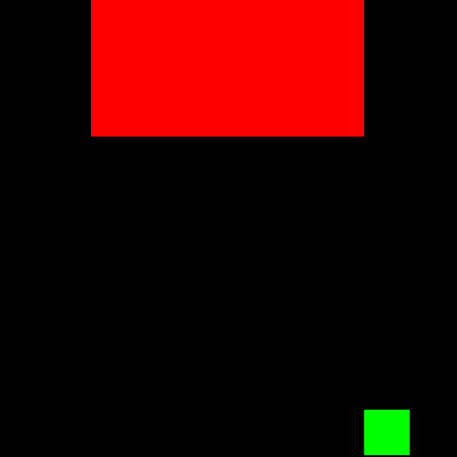
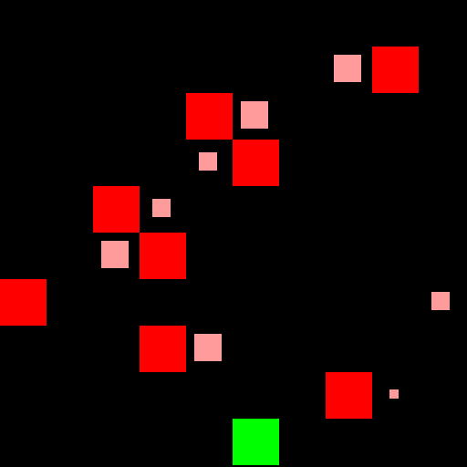
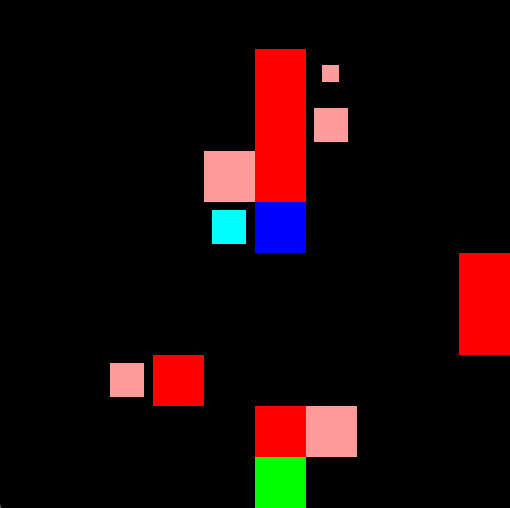

<div align="center">
    <a href=gym_minatar/breakout.py>
        <figure>
            
            <figcaption>Breakout</figcaption>
        </figure>
    </a>
    <a href=gym_minatar/space_invaders.py>
        <figure>
            
            <figcaption>Space Invaders</figcaption>
        </figure>
    </a>
    <a href=gym_minatar/freeway.py>
        <figure>
            
            <figcaption>Freeway</figcaption>
        </figure>
    </a>
    <a href=gym_minatar/asterix.py>
        <figure>
            
            <figcaption>Asterix</figcaption>
        </figure>
    </a>
    <a href=gym_minatar/seaquest.py>
        <figure>
            
            <figcaption>Seaquest</figcaption>
        </figure>
    </a>
</div>

## Overview
Collection of simplified [Atari](https://gymnasium.farama.org/environments/atari/)
games fully compatible with [Gymnasium](https://github.com/Farama-Foundation/Gymnasium).
Inspired by [MinAtar](https://github.com/kenjyoung/MinAtar).

#### Gym-MinAtar vs MinAtar
- All games are rendered with [PyGame](https://www.pygame.org/news) rather than
  [Matplotlib](https://matplotlib.org/), as in classic
  [Gymnasium](https://github.com/Farama-Foundation/Gymnasium) environments.
- Different observation spaces. In MinAtar, the observation space has separate
  channels for every entity in the game. Gym-MinAtar uses lower dimensional
  observation spaces with continuous values in [-1, 1].
  - For example, in MinAtar's Space Invaders, aliens moving left and aliens moving
  right are encoded in two separate channels (with binary values). Instead,
  Gym-MinAtar uses one channel with -1 for aliens moving left, and 1 for aliens
  moving right.
  - Another example is Freeway. MinAtar uses one channel for each car, while
  Gym-MinAtar uses one channel for all cars (the absolute value denotes the
  speed, the sign denotes the direction).
  - Different rendering scheme. MinAtar uses one pixel for trails (like
  car trails), with different colors for different speeds. Gym-MinAtar uses the
  same color for all trails, but trails are longer for faster cars.
  - Please refer to the examples below for more details about the observation spaces.
- Game-specific dynamics are different (like cooldown times and speeds).

### Install and Make an Environment
```
pip install -e .
```

```python
import gymnasium
import gym_minatar
env = gymnasium.make("Gym-MinAtar/SpaceInvaders-v1", render_mode="human")
env.reset()
env.step(1) # LEFT
env.step(3) # SHOOT
```

### Playground
```
pip install -e .[playground]
python playground.py breakout
```
This will start a Breakout game (commands are displayed on the terminal).
The flag `--record` allows you to record the game and save it to a GIF.
The flag `--practice` makes the game wait until the user sends an action (otherwise,
every 0.5 seconds the game receives NO-OP).

## Games
Actions are discrete, while observations have shape `(rows, cols, channels)`
with values in [-1, 1].
The number of actions and channels depends on the game.
All boards have size (10, 10) by default. To change it:
```python
gymnasium.make(..., size=(rows, cols))
```
To train from pixels:
```python
import gymnasium
import gym_minatar
env = gymnasium.make("Gym-MinAtar/SpaceInvaders-v1", render_mode="rgb_array", window_size=(84, 84))
env = gymnasium.wrappers.AddRenderObservation(env, render_only=True)
```

Below are some details about the games.
For full details, please refer to the docs in the source code (click on the game name).

### [`Gym-MinAtar/Breakout-v1`](gym_minatar/breakout.py)
<table>
  <tr>
    <td style="width: 250px;">
      
    </td>
    <td>
      <ul style="list-style-type:circle">
        <li>The player (green) has to bounce a ball (blue) to break bricks (gray).</li>
        <li>For every broken brick, the player receives 1 point.</li>
        <li>Once all bricks are broken, a new round starts with the ball moving faster.</li>
        <li>The ball speed is denoted by its trail (longer trails means faster ball).
        If the ball moves slower than 1 tile per timestep, its trail is smaller.</li>
        <li>The game ends if the player misses the ball.</li>
        <li>The player has 3 actions (LEFT, RIGHT, NO-OP) and the observation space
        has 3 channels for (in order): player, bricks, ball.</li>
        <li>This game is <b>fully observable.</li>
      <ul>
    </td>
  </tr>
</table>

### [`Gym-MinAtar/SpaceInvaders-v1`](gym_minatar/space_invaders.py)
<table>
  <tr>
    <td style="width: 250px;">
      
    </td>
    <td>
      <ul style="list-style-type:circle">
        <li>The player (green) has to shoot down waves of aliens (red) with bullets
        (white), and receives 1 point every time it hits one alien.</li>
        <li>Aliens shoot the player as well (yellow), move left (pale red) or
        right (bright red), and change direction when they hit the sides of the board.</li>
        <li>Before changing direction, they move one tile down.
        As they move down, their speed increases.</li>
        <li>If the player destroys all aliens, a new round starts, with the aliens
        starting closer to the player.</li>
        <li>The game ends when the player is hit by a bullet or an alien.</li>
        <li>The player has 6 actions (LEFT, DOWN, RIGHT, UP, SHOOT, NO-OP) and
        the observation space has 4 channels for (in order): player, aliens,
        player bullets, aliens bullets</li>
        <li>This game is <b>partially observable</b>, because observations
        don't encode shooting cooldown time. However, most of the time this
        can be inferred by how far the player bullet has traveled.
      </ul>
    </td>
  </tr>
</table>

### [`Gym-MinAtar/Freeway-v1`](gym_minatar/freeway.py)
<table>
  <tr>
    <td style="width: 250px;">
      
    </td>
    <td>
      <ul style="list-style-type:circle">
        <li>The player (green) has to cross a road while avoiding cars (red).</li>
        <li>Cars move at different speed, denoted by the trail behind them
        (longer trails means faster car).
        If a car moves slower than 1 tile per timestep, its trail is smaller.</li>
        <li>When a car leaves the board, it spawns in the same row from the opposite side.</li>
        <li>When the player crosses the road (reaches the top), it receives 1 point
        and a new round starts with faster cars.</li>
        <li>The game ends when the player is hit by a car.</li>
        <li>The player has 3 actions (UP, DOWN, NO-OP) and the observation space
        has 2 channels for (in order): player and cars.</li>
        <li>This game is <b>fully observable</b>.</li>
      </ul>
    </td>
  </tr>
</table>


### [`Gym-MinAtar/Asterix-v1`](gym_minatar/asterix.py)
<table>
  <tr>
    <td style="width: 250px;">
      
    </td>
    <td>
      <ul style="list-style-type:circle">
        <li>The player (green) has to collect treasures (blue) to get points (1 per treasure)
        while avoiding enemies (red).</li>
        <li>Treasures and enemies move at different speed, denoted by the trail behind them
        (the longer, the faster).
        If they moves slower than 1 tile per timestep, theyr trail is smaller.</li>
        <li>When treasures and enemies leaves the screen (or are collected, if treasure)
        some time must pass before a new one randomly appears in the same row.</li>
        <li>Over time, enemies and treasures speed increases and respawn wait time decreases.</li>
        <li>The game ends when the player is hit by an enemy.</li>
        <li>The player has 5 actions (LEFT, DOWN, RIGHT, UP, NO-OP) and the observation space
        has 3 channels for (in order): player, enemies, and treasures.</li>
        <li>This game is <b>partially observable</b>, because 1) observations don't encode
        respawn time, and 2) when treasures and enemies spawn, their direction cannot
        be determined immediately (they have no trail yet).</li>
    </td>
  </tr>
</table>


### [`Gym-MinAtar/Seaquest-v1`](gym_minatar/seaquest.py)
<table>
  <tr>
    <td style="width: 250px;">
      
    </td>
    <td>
      <ul style="list-style-type:circle">
        <li>The player (green) must collect divers (blue) and bring them to the
        surface (gray) while hitting enemies shooting bullets (white) from its front (bright green).</li>
        <li>Enemies are fishes (purple) and submarines (red). Submarines can shoot bullets (yellow).</li>
        <li>The player must wait some time before shooting again. Submarines
        shoot as soon as they enter the board, and then again as soon as
        their bullet leaves the board.</li>
        <li>The player has limited oxygen (gauge at the bottom left of the board)
        that depletes over time.</li>
        <li>Hitting an enemy gives the player 1 point.</li>
        <li>Carrying 6 divers to the surface gives as many points as the amount of
        oxygen left, and the oxygen is replenished. The number of divers carried by
        the player is denoted by gauge at the bottom right of the board.
        If the player is carrying less than 6 divers but at least 1, it doesn't
        receive any point but its oxygen is still replenished.</li>
        <li>The game ends if the player is hit by an enemy or a bullet, its oxygen
        depletes, or if it emerges without carrying any diver.</li>
        <li>Enemies and divers move at different speeds and leave a trail. When one
        leaves the board, some time must pass before a new one respawns (like Asterix).</li>
        <li>Every time the player emerges and submerges again, difficulty increases
        (enemies and divers move faster, respawn time decreases).</li>
        <li>The player has 6 actions (LEFT, DOWN, RIGHT, UP, SHOOT, NO-OP) and
        the observation space has 6 channels for (in order): player and bullets,
        fishes, submarines and bullets, divers, oxygen gauge, and divers carried gauge.</li>
        <li>This game is <b>partially observable</b>. First, observations
        don't encode shooting cooldown time (although this can be inferred
        from how far the player bullet has traveled). Second, oxygen reserve is
        not accurately represented (although the player does not need to know it
        exactly to act optimally).</li>
      <ul>
    </td>
  </tr>
</table>

## Observations
Below are some example of both default and pixels observations to better
understand how speed and trail are encoded.


```
[[0. 0. 0. 0. 0. 0.  0. 0. 0. 0.]
 [0. 0. 0. 0. 0. 0.  0. 0. 0. 0.]
 [0. 0. 0. 0. 0. 0.  0. 0. 0. 0.]
 [0. 0. 0. 0. 0. 0.  0. 0. 0. 0.]
 [0. 0. 0. 0. 0. 0.  0. 0. 0. 0.]
 [0. 0. 0. 0. 0. 0.  0. 0. 0. 0.]
 [0. 0. 0. 0. 0. 0.  0. 0. 0. 0.]
 [0. 0. 0. 0. 0. 0.5 0. 0. 0. 0.]
 [0. 0. 0. 0. 0. 0.  1. 0. 0. 0.]
 [0. 0. 0. 0. 0. 0.  0. 0. 0. 0.]]
```
<div style="clear: both;"></div>
<br>
Third channel of Breakout observation. The sign of non-zero elements denotes
the ball direction (negative going up, positive going down); the
absolute value is proportional to the speed <it>if the ball moves slower than
1 tile per timestep</it>. In the example, the ball takes 2 timesteps to move.
<br><br>


```
[[ 0.  0.   0.  0.  0.   0.  0.  0.  0.  0.]
 [-1. -0.25 0.  0.  0.   0.  0.  0.  0.  0.]
 [ 0.  0.   0.  0.  0.5  1.  0.  0.  0.  0.]
 [ 0.  1.   1.  0.  0.   0.  0.  0.  0.  0.]
 [ 0.  0.   0. -1. -0.25 0.  0.  0.  0.  0.]
 [ 0.  0.   0.  0.  0.5  1.  0.  0.  0.  0.]
 [-1. -0.5  0.  0.  0.   0.  0.  0.  0.  0.]
 [ 1.  1.   0.  0.  0.   0.  0.  0.  0.  0.]
 [ 0.  0.25 1.  0.  0.   0.  0.  0.  0.  0.]
 [ 0.  0.   0.  0.  0.   0.  0.  0.  0.  0.]]
```
<div style="clear: both;"></div>
<br>
Second channel of Freeway observation. The encoding of speed and trail
follows the same rules of Breakout. The example shows that cars moving at 1 tile
per timestep (third and seventh car) encode trails with absolute value 1.
It also shows cars moving slower than 1 tile every 2 timestep (first, fourth, and eighth car).
<br><br>


```
[[ 0.  0.   0.  0.  0.  0.  0.  0.  0.  0.]
 [ 0.  0.   0.  0.  0.  0. -1. -0.5 0.  0.]
 [ 0.  0.   0.  0.  0.  0.  0.  0.  0.  0.]
 [-1.  -0.5 0.  0.  0.  0.  0.  0.  0.  0.]
 [ 0.  0.   0.  0.  0.  0.  0.  0.  0.  0.]
 [ 0.  0.   0.  0.  0.  0.  0.  0.  0.  0.]
 [ 0.  0.   0.  0.  1.  1.  0.  0.  0.  0.]
 [ 0.  0.   1.  1.  0.  0.  0.  0.  0.  0.]
 [ 0.  0.   0.  0. -1. -1.  0.  0.  0.  0.]
 [ 0.  0.   0.  0.  0.  0.  0.  0.  0.  0.]]
```
<div style="clear: both;"></div>
<br>
Second channel of Asterix observation. It's like Freeway's, but it only encodes
enemies (treasures are encoded in the third channel).
<br><br>


```
[[ 0.   0. 0.  0. 0. 0. 0. 0.  0.  0.  ]
 [ 0.   0. 0.  0. 0. 0. 0. 0.  0.  0.  ]
 [ 0.   0. 0.  0. 0. 0. 0. 0.  0.  0.  ]
 [ 0.   0. 0.  0. 0. 0. 0. 0.  0.  0.  ]
 [ 0.   0. 0.  0. 0. 0. 0. 0.  0.  0.  ]
 [ 0.   0. 0. -1. 0. 0. 0. 0. -1. -0.12]
 [ 0.   0. 0.  0. 0. 0. 0. 0.  0.  0.  ]
 [ 0.   0. 0.  0. 0. 0. 0. 0.  0.  0.  ]
 [ 0.75 1. 0.  0. 0. 1. 0. 0.  0.  0.  ]
 [ 0.   0. 0.  0. 0. 0. 0. 0.  0.  0.  ]]
```
<div style="clear: both;"></div>
<br>
Third channel of Seaquest observation. It's like Asterix's but for submarines,
and with the addition of bullets.
